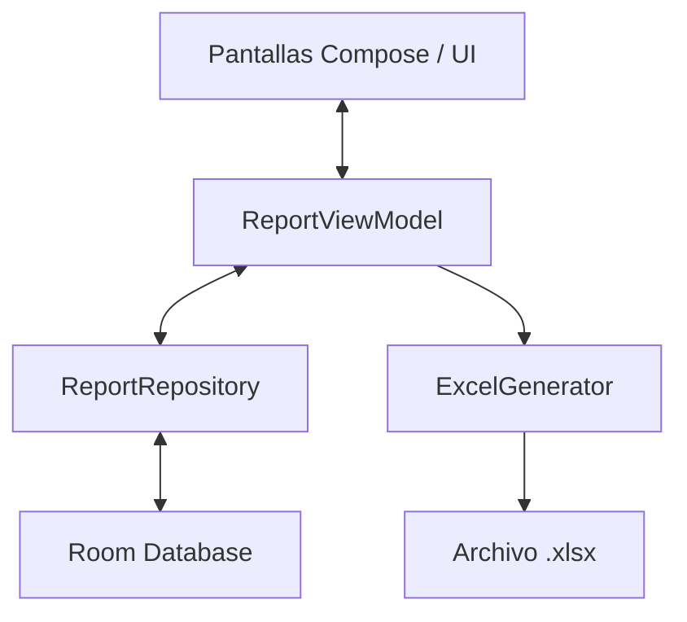

# 🏛️ Documentación de Arquitectura Técnica (ARCHITECTURE.md)

Este documento describe en detalle la arquitectura del sistema, los flujos de datos y los patrones utilizados en **CEIReport**. Está diseñado para dar contexto técnico inmediato a cualquier IA o desarrollador que trabaje en la base de código.

---

## 🏗️ 1. Patrón de Arquitectura

CEIReport sigue la arquitectura recomendada por Google Android (**MVVM - Model-View-ViewModel**):



- **UI Layer (Jetpack Compose)**: Componentes reactivos orientados a estado. Respetan el soporte de tema claro/oscuro a través de `MaterialTheme.colorScheme`.
- **ViewModel Layer**: `ReportViewModel` expone `StateFlow<Report?>` (`currentReport`) y `StateFlow<List<Report>>` (`reportsList`), además de coordinar operaciones asíncronas mediante `viewModelScope`.
- **Data Layer**: Entidad Room `Report` persistida en SQLite local mediante `ReportDao`.
- **Export Engine**: `ExcelGenerator` genera directamente documentos OpenXML (`.xlsx`) mediante Apache POI sin depender de servicios externos ni backend.

---

## 📊 2. Modelo de Datos Principal (`Report.kt`)

La clase de datos `@Entity(tableName = "reports")` almacena la totalidad del reporte diario:

| Campo | Tipo | Paso UI | Descripción |
|---|---|---|---|
| `id` | `Long` (PK) | Todos | Identificador único autogenerado |
| `proyecto` | `String` | Paso 1 | Nombre oficial del proyecto |
| `fase` | `String` | Paso 1 | Fase de construcción |
| `area` | `String` | Paso 1 | Área específica de trabajo |
| `sistema` | `String` | Paso 1 | Sistema involucrado |
| `disciplina` | `String` | Paso 1 | Disciplina técnica |
| `noContrato` | `String` | Paso 1 | Número de contrato contractual |
| `descripcionAlcance` | `String` | Paso 1 | Descripción breve del alcance |
| `actividadesSeguridad` | `List<String>` | Paso 2 | Lista de charlas y medidas de seguridad |
| `clima` | `List<String>` | Paso 2 | Identificadores de clima seleccionados |
| `actividadesRealizadas`| `List<String>` | Paso 3 | Tareas ejecutadas en la jornada |
| `observacionesList` | `List<String>` | Paso 3 | Notas de campo u observaciones |
| `fuerzaTrabajoCantidades`| `List<String>` | Paso 4 | Cantidades de personal por cada uno de los 10 roles |
| `fuerzaTrabajoHoras` | `List<String>` | Paso 4 | Horas trabajadas por cada rol |
| `maquinariaCantidades` | `List<String>` | Paso 5 | Cantidades por cada uno de los 7 equipos |
| `maquinariaHoras` | `List<String>` | Paso 5 | Horas de operación por equipo |
| `actividadesPlaneadas` | `List<String>` | Paso 6 | Plan de trabajo para el día siguiente |
| `photos` | `List<String>` | Paso 7 | Rutas de archivos de fotos tomadas en campo |
| `photoCaptions` | `List<String>` | Paso 7 | Notas descriptivas por cada foto |
| `croquisPath` | `String?` | Paso 7 | Ruta de imagen del esquema o croquis |
| `areasAvance` | `List<String>` | Paso 8 | Nombres de áreas/disciplinas con avance |
| `avancePorcentajes` | `List<String>` | Paso 8 | Porcentaje de avance (0-100%) por área |
| `supervisor` | `String` | Paso 8 | Nombre del Supervisor de Proyecto |
| `supervisorSignaturePath`| `String?` | Paso 8 | Ruta de imagen de la firma del supervisor |
| `technicianName` | `String` | Paso 8 / Paso 1 | Nombre del Responsable de Contratista |
| `signaturePath` | `String?` | Paso 8 | Ruta de imagen de la firma del contratista |
| `isDraft` | `Boolean` | Todos | `true` si el reporte es un borrador en edición |

---

## 🔄 3. Flujo de Navegación del Formulario (8 Pasos)

La navegación del formulario utiliza un `HorizontalPager` dentro de `MainActivity.kt` sincronizado con una barra de progreso inteligente (`StepProgressBar`):

```text
[Paso 1] GeneralDataScreen          (Identificación y Contrato)
    ↓
[Paso 2] SafetyWeatherScreen        (Seguridad y Clima)
    ↓
[Paso 3] ActivitiesObservationsScreen (Actividades Realizadas y Notas)
    ↓
[Paso 4] WorkforceScreen            (Fuerza de Trabajo y Horas Hombre)
    ↓
[Paso 5] MachineryScreen            (Maquinaria y Horas Máquina)
    ↓
[Paso 6] PlannedActivitiesScreen    (Actividades Siguiente Día)
    ↓
[Paso 7] ReportFormScreen           (Fotos con nota y Croquis)
    ↓
[Paso 8] FinalizeScreen             (Avance por Área, Firmas y Exportar Excel)
```

### Reglas de Navegación:
- **Botón Atrás en TopAppBar / Gestos Nativo (`BackHandler`)**: Guarda borrador automáticamente y regresa al Dashboard (`ReportListScreen`).
- **Navegación Horizontal (Swipe)**: Permite deslizar libremente entre pasos.
- **Indicador de Validación (`StepProgressBar`)**: Muestra en **Naranja (`AccentOrange`)** los pasos recorridos previamente que se dejaron sin llenar.

---

## 📄 4. Motor de Exportación Excel (`ExcelGenerator.kt`)

`ExcelGenerator` construye hojas `.xlsx` profesionales siguiendo el estándar visual de la empresa:

1. **Jerarquía Visual y Tipografía**:
   - Fuente **Calibri** en diversos tamaños (18pt Título, 11pt Secciones, 10pt Datos).
   - Ocultación de cuadrículas por defecto (`sheet.isDisplayGridlines = false`).
   - Paneles congelados (`sheet.createFreezePane(0, 2)`) en las filas de título/cabecera.
2. **Paleta de Colores Corporativa**:
   - **Azul Oscuro CEI (`#1A3C6E`)**: Cabecera principal y marca.
   - **Azul Medio CEI (`#2E5FA3`)**: Encabezados de bandas de sección y columnas.
   - **Azul Claro CEI (`#D6E4F7`)**: Relleno de etiquetas.
   - **Azul Pálido CEI (`#EBF4FF`)**: Filas alternadas (Zebra pattern).
   - **Naranja CEI (`#E87722`)**: Filas de Totales, divisores y pie de página.
3. **Distribución en 2 Columnas para Datos Generales**:
   - Columna 0-2: Proyecto, Fase, Área, Sistema, Disciplina, Responsable.
   - Columna 3-5: Fecha, No. Contrato, Ubicación GPS, Alcance.
4. **Dibujo de Fotos y Firmas**:
   - Inserta fotos redimensionadas manteniendo aspecto mediante `compressImage()`.
   - Las firmas del contratista y supervisor se colocan una al lado de la otra sobre líneas de firma formales.

---

## ⚠️ 5. Consideraciones para la IA al Modificar Código

1. **JAVA_HOME**: Siempre ejecutar gradle antecediendo `$env:JAVA_HOME="C:\Program Files\Android\Android Studio\jbr"` en PowerShell.
2. **Soporte de Tema**: NUNCA usar `Color.White` o `Color.Black` hardcodeados en contenedores o textos de formularios. Utilizar siempre `MaterialTheme.colorScheme.surface`, `onSurface` o `onSurfaceVariant`.
3. **Firmas Interactivas (`SignaturePad`)**: El lienzo mide su tamaño dinámico mediante `size.width` y `size.height` para escalar los trazos a un Bitmap de resolución nativa 1:1. Mantener este principio si se modifica `SignaturePad.kt`.
